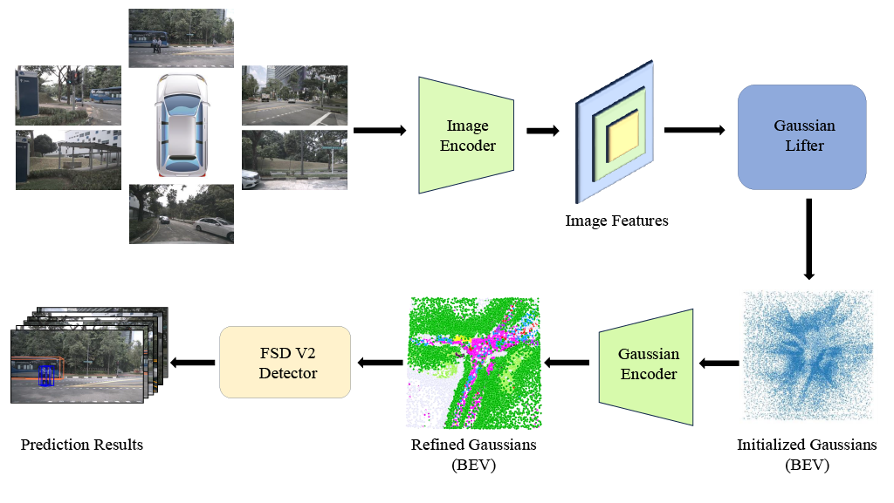

# GaussianDet3D: Bridging Gaussian Splatting and Sparse LiDAR Detection for Multi-View 3D Object Detection

**[Malaz Tamim](https://malaztamim.com/)1,3*, [Wenzhao Zheng](https://wzzheng.net/)2, [Johannes Meier](https://cvg.cit.tum.de/members/mejo)1,3,4, [Daniel Cremers](https://cvg.cit.tum.de/members/cremers)1,3, [Kurt Keutzer](https://www2.eecs.berkeley.edu/Faculty/Homepages/keutzer.html)2**

1Technical University of Munich &nbsp; 2UC Berkeley &nbsp; 3Munich Center for Machine Learning &nbsp; 4DeepScenario

**DriveX Workshop @ CVPR 2026 — Oral Presentation**

---

> 🚧 **Code coming soon!** We are preparing the codebase for release. Stay tuned by watching/starring this repo.

---

## Overview

We present **GaussianDet3D**, the first method to apply 3D Gaussian Splatting from multi-view images to 3D object detection in autonomous driving. Gaussian primitives are treated as a pseudo-LiDAR point cloud fed directly into a sparse LiDAR detector, encoding geometry, orientation, opacity, and per-class semantics. Temporal aggregation across frames enables precise velocity estimation without explicit tracking. On the **nuScenes benchmark**, GaussianDet3D achieves **state-of-the-art translation error and velocity error** among all camera-based methods, outperforming BEVFormer by **8.1%** and **13.1%** respectively.

Multi-view images are encoded (ResNet-101-DCN + FPN), lifted into 3D Gaussian primitives via depth estimation, refined by the Gaussian Encoder (sparse 3D conv + deformable cross-attention), and passed as a pseudo-LiDAR point cloud to FSD V2 for 3D bounding box prediction.

## Citation

Citation information will be available upon arXiv publication.

## Acknowledgements

The project page template is borrowed from [Nerfies](https://github.com/nerfies/nerfies.github.io).
